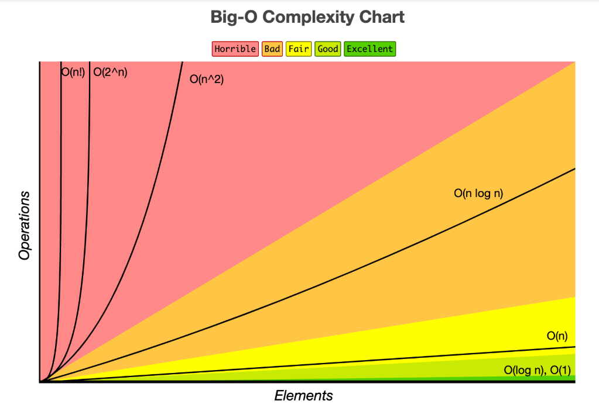

紀錄JAVA LeetCode解題
===

# 時間/空間複雜度筆記
[時間/空間複雜度](https://qvlowo.github.io/2025/03/10/%E3%80%90LeetCode%E3%80%91%E5%88%B7%E9%A1%8C%E5%89%8D%E7%9A%84%E6%BA%96%E5%82%99-Big-O-notation/)

---
# 貪心演算法 Greedy Algorithm

## 題目: 
> 121

---
# 雙指針 two pointers
## 題目:
> 88